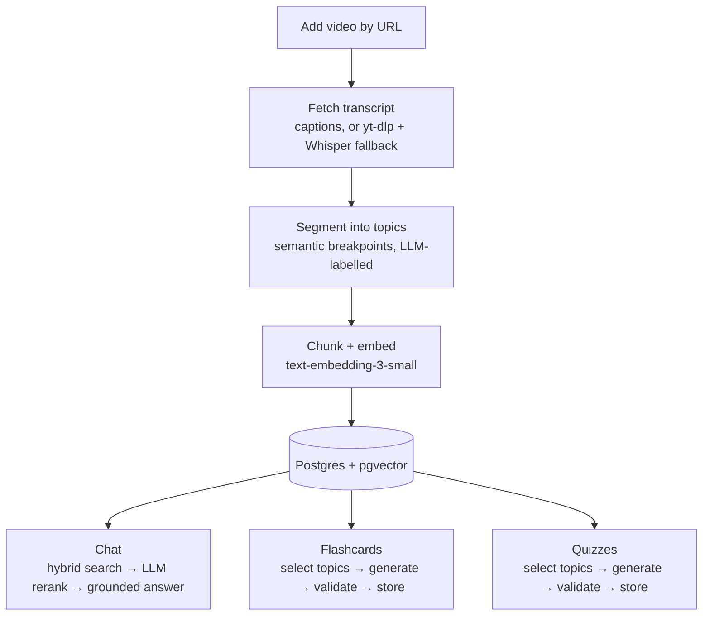

# Grasp

A study companion built on a RAG pipeline over YouTube transcripts. Add a video to your library, then chat with it (grounded answers with clickable timestamps), generate flashcard decks, or generate quizzes. Every answer, card, and question traces back to a moment in the video.

The point of the project is **retrieval and generation quality**, and it is measured rather than asserted. See [Evaluation](#evaluation).

## Running it

Requires Docker and an OpenAI API key.

```bash
export OPENAI_API_KEY=sk-...
docker compose up --build
docker compose exec api alembic upgrade head
```

The web app runs at http://localhost:5173 and the API at http://localhost:8000/api.

## Architecture



Ingestion runs once per video as a background task. Chat, flashcards, and quizzes are three separate UI sections hitting three separate endpoint groups — there's no app-level query router; which section you're in tells the API what you want. Flashcards and quizzes share one pipeline shape (`docs/ARCHITECTURE.md` §5): pick segments, build context from their summaries and transcript excerpts, generate with a strict JSON schema, validate every item against its cited segment's actual transcript, store. Full detail, including the retrieval and generation steps, is in [`docs/ARCHITECTURE.md`](docs/ARCHITECTURE.md).

## Evaluation

Three offline evals, run inside the `api` container. Results are committed as dated JSON under [`api/eval/results/`](api/eval/results/). Methodology and trade-offs are in [`docs/ARCHITECTURE.md` §6](docs/ARCHITECTURE.md#6-evaluation).

```bash
docker compose exec api python -m app.eval.retrieval      # retrieval metrics
docker compose exec api python -m app.eval.chat           # LLM-judged chat answers
docker compose exec api python -m app.eval.faithfulness   # LLM-judged flashcards and quizzes
```

The eval set covers three deliberately different videos: a 56-minute university lecture, a 3-hour podcast, and a 10-minute programming tutorial. The golden set has 26 hand-reviewed questions, each with the time span where the video answers it, plus 6 adjacent questions the video *doesn't* answer and 6 broad whole-video questions ("What will I learn from this tutorial?").

### Retrieval

A retrieved chunk counts as a hit if it overlaps the golden time span. Production retrieves 8 candidates by hybrid search, then reranks down to 5.

| strategy | hit@1 | hit@3 | hit@5 | MRR |
|---|---|---|---|---|
| vector only | 0.81 | 0.92 | 0.96 | 0.87 |
| hybrid (vector + keyword, RRF) | 0.85, 0.88 | 0.92, 0.96 | 0.96 | 0.89, 0.92 |
| **hybrid + LLM rerank** (production) | **0.88, 0.92** | **0.96** | **0.96** | **0.92, 0.94** |

**Out-of-scope questions correctly declined: 6/6.**

The eval paid for itself on its first run. Keyword search used `plainto_tsquery`, which requires *every* term in the question to appear in a chunk. It matched nothing on 24 of the 26 questions, so "hybrid" search had silently been pure vector search. Switching to any-term matching raised hybrid + rerank hit@1 from **0.81 to 0.88** and MRR from **0.86 to 0.92**. A lecture question about the Marshall Plan, which no strategy had retrieved at any rank, went to rank 1: an exact name the embedding had flattened, which is the case hybrid search exists for. ([before](api/eval/results/retrieval-2026-09-19.json) / [after](api/eval/results/retrieval-2026-09-19-keyword-or.json))

The segmentation fix ([#15](https://github.com/jdavidIP/grasp/issues/15)) then cost some of that at rank 1. Chunks never cross topic boundaries, so better topics moved every chunk boundary, and production hit@1 went from 0.88 to 0.81 (identical across two runs) while hit@3 held at 0.96. I accepted the trade: every answer still reaches the chat model among the 5 reranked chunks, and the generation metrics below improved. ([results](api/eval/results/retrieval-2026-09-19-segmentation.json))

**Chunk size ([#17](https://github.com/jdavidIP/grasp/issues/17)): 500 tokens diluted short answers, 250 mostly fixed it.** Both lecture questions no strategy retrieved at baseline had their answer sitting inside a ~500-token chunk that was mostly about something else. Halving `CHUNK_TARGET_TOKENS` to 250, reprocessing, and running the eval twice at each size: production hit@1 moved from a 0.81–0.85 range to 0.88–0.92, and MRR from 0.88–0.90 to 0.92–0.94 — ranges that don't overlap, so this isn't noise. The Marshall Plan question is now retrieved even by pure vector search (rank 4), a stronger fix than hybrid search's exact-name match. The other question still misses at every strategy: its answer sits inside a segment whose entire transcript is 167 tokens, already below the 250-token target, so there's no chunk left to split — that miss is a segmentation-boundary problem, not a chunk-size one. The cost: about 1.8x as many chunks to embed (the tutorial went from 6 to 11), and less transcript per chunk surviving into chat generation (5 reranked chunks now carry roughly half as much context). At 250 tokens, chat answers still score 1.00 faithful ([Chat answers](#chat-answers)), though there's no 500-token chat run to compare against. ([500-token: run1](api/eval/results/retrieval-2026-09-23-chunk500-run1.json), [run2](api/eval/results/retrieval-2026-09-23-chunk500-run2.json) / [250-token: run1](api/eval/results/retrieval-2026-09-23-chunk250-run1.json), [run2](api/eval/results/retrieval-2026-09-23-chunk250-run2.json))

### Chat answers

Every golden question goes through the production chat path, and gpt-4o judges the answer against the sources that path returned — the chunks or topic summaries the answer model actually saw ([#21](https://github.com/jdavidIP/grasp/issues/21)). Two runs, identical to two decimals:

| questions | n | supported | answers the question | declines | routed to the broad path |
|---|---|---|---|---|---|
| specific | 26 | 1.00 | 1.00 | — | — |
| broad | 6 | 1.00 | 1.00 | — | **0.50** |
| out-of-scope | 6 | 1.00 | — | 1.00 | — |

([run1](api/eval/results/chat-2026-09-24-run1.json), [run2](api/eval/results/chat-2026-09-24-run2.json))

- **The answer step isn't where chat loses quality.** Given the right sources, gpt-4o-mini answers faithfully and declines cleanly. With the score at the ceiling, a stronger answer model can't show a gain on this eval, so it stays gpt-4o-mini. Where chat does fail is upstream: retrieval (above) and routing.
- **Half the broad questions are routed wrong.** The router sends a question to the whole-video path only if it contains a keyword ("summarize", "overview"). "What will I learn from this tutorial?" has a content word, so it goes down the specific path and gets answered from 5 chunks. The judge still scores those answers as answering the question: it sees only the sources the answer saw, so it can't tell what a 5-chunk summary of a 3-hour podcast left out. The routing rate is the number that catches it.
- **Chat states a speaker slip as fact** ("the Soviet Union invaded Ukraine") in both runs. The #18 fix covered flashcards and quizzes, not the chat prompts ([#34](https://github.com/jdavidIP/grasp/issues/34)). The judge counts repeating the speaker as faithful, and didn't flag the slip in either run, so the eval's slip count can't be relied on for this.
- Reading the judge's reasons caught a bug in the judge itself before these runs: it marked a plain "the video doesn't cover this" as an unsupported claim.

### Cost per feature

The LLM wrapper totals tokens per model while an eval runs, so each feature's cost is measured rather than estimated. gpt-4o-mini tokens per request (prompt + completion), across two runs:

| request | gpt-4o-mini tokens | calls |
|---|---|---|
| chat, specific question | 3,460 / 3,450 | 2 (rerank, answer) |
| flashcard deck, 10 cards, whole video | 15,600 / 17,400 | 8–9 |
| quiz, 10 questions, whole video | 20,800 / 30,100 | 10–13 |

Embeddings add under 3% on top. The quiz spread is the top-up: when validation leaves a quiz short, it generates once more for the shortfall, which run 2 needed. The gpt-4o judge is eval-only: it uses about half to two-thirds as many tokens as what it judges, at gpt-4o's higher price. ([faithfulness run1](api/eval/results/faithfulness-2026-09-24-usage-run1.json), [run2](api/eval/results/faithfulness-2026-09-24-usage-run2.json))

### Generation faithfulness

gpt-4o judges every generated flashcard and quiz question against the raw transcript of the segment it cites. It uses a different model from the gpt-4o-mini generator, so the generator isn't grading itself. The table shows what users see, meaning the items that survive the pipeline's own validation pass; the per-run results files also report the raw candidates and the rejected ones.

| | Phase 7 baseline (1 run) | now (2 runs) |
|---|---|---|
| quiz questions: answer key correct | 0.80 | 0.97, 1.00 |
| quiz questions shipped, of 30 requested | 30 | 30, 30 |
| flashcards: faithful | 0.81 | 0.87, 0.93 |
| flashcards shipped, of 30 requested | 27 | 30, 30 |

Single runs on about 30 items are noisy: *identical* code scored 0.71 and 0.87 on quiz key correctness. So every change below was judged on at least two runs, and the per-run results are all committed under [`api/eval/results/`](api/eval/results/). The judge's per-item reasoning is in each results file. What it shows:

- **The validators were checking against the wrong context, and one run made that look fixed.** After the segmentation fix ([#15](https://github.com/jdavidIP/grasp/issues/15)) a single run showed shipped flashcards scoring above raw output, so the flashcard validator looked net-useful. Three more runs said otherwise. In the two cleanest, it rejected 11 and 14 cards, of which 11 and 12 were faithful, and shipped decks of 23 and 21 of 30; the third pointed the same way. The cause, for both flashcards and quizzes, was that each validator checked items against the same summary-plus-two-excerpts context the generator had seen. It couldn't verify items grounded elsewhere in a topic (so it rejected good ones), and it couldn't tell a fact stated in the video from one the generator filled in from general knowledge (so it kept bad ones).
- **Fix ([#16](https://github.com/jdavidIP/grasp/issues/16)): validate each item against the full transcript of the segment it cites,** one call per cited segment, in parallel. By my token estimate it costs about the same, because only cited segments are sent. Per-feature cost is now measured ([#21](https://github.com/jdavidIP/grasp/issues/21), see [Cost per feature](#cost-per-feature)), but validation is counted together with generation, so the old-versus-new validator comparison is still an estimate. Wrongly rejected cards fell from 11 and 12 per run to between 0 and 2 across the four runs since, and quiz answer keys went from about 0.81 (the mean of three runs after the segmentation fix: 0.86, 0.71, 0.87) to 0.93. The 0.80 baseline above also includes the segmentation fix's gain. The validator now discriminates: rejected quiz questions score 0.54 and 0.62 faithful against 0.93 for the ones shipped. Two prompt changes went with it (keyed claims must be stated, not inferred; true/false statements must restate or be contradicted by the video), but by themselves they didn't move the overall number outside noise.
- **A stricter validator ships shorter quizzes, so it tops up.** A 10-question podcast quiz came back with 7, 9, 10 and 5 questions across four runs. If validation leaves a quiz short, it now generates once more for just the shortfall, validates it the same way, and stops (`TOP_UP_ROUNDS = 1`). Both runs then shipped the full 30. On longer videos that roughly doubles the generation calls, all on gpt-4o-mini.
- **What's left:** about 2 in 30 shipped quiz questions still have a debatable key, mostly multi-select questions where a distractor is arguably true. Shipped flashcard faithfulness is 0.83-0.93 across four runs, within noise of before: the flashcard fix restored full decks and stopped false rejections, but it didn't measurably make cards more faithful. Grading is deterministic, so a bad key marks a correct answer wrong.
- **Fix ([#18](https://github.com/jdavidIP/grasp/issues/18)): don't state a speaker slip as fact, and don't silently correct it either.** Speakers misspeak and captions mishear (the tutorial's "angle brackets" for Python lists), and generation previously repeated whatever was said as literal truth. It's now told to avoid a slip-dependent item when it can, and otherwise state the corrected fact while naming the slip — a `note` column for flashcards, folded into the existing `explanation` for quizzes; the validators and the eval judge were all updated with the matching exception, or they'd reject a correctly-noted item as invented. Two eval runs found **zero of the three known slips stated as fact across 148 sampled items**. Both runs happened to sample zero items touching those exact facts at all — whole-video scope spreads 10 kept items across every topic, so one specific fact isn't guaranteed a hit — so the automated eval confirms the safety property but not reliably the note-writing itself; a deliberate topic-scoped test against the real slip confirmed that part directly, producing the exact note the prompt asks for.

### Known limitations

- **Segmentation is reviewed by hand, not scored.** Reviewing the eval videos is how the auto-caption bug was found (the 3-hour podcast had become 4 topics; it's now 20). Whole-video generation still gives every topic the same 2 excerpts, so the podcast's longest topic (28 minutes) is only ~15% represented. This is a known limit, deferred until an eval shows it hurts ([#15](https://github.com/jdavidIP/grasp/issues/15)).
- **Small eval set.** 26 retrieval questions and about 30 judged items per group give directional numbers, not precise ones. At 250 tokens per chunk, the tutorial has only 11 chunks, so @5 and @8 saturate for short videos. hit@1 and MRR are the metrics that separate strategies.
- **Broad questions are few, and half are misrouted.** 6 broad questions measure routing and answers directly, but the router is a keyword heuristic that sends naturally worded whole-video questions down the specific path. Fixing it is deferred until there's real usage phrasing to tune against.
- **One retrieval miss survives chunk tuning.** A lecture question's answer sits inside a segment whose whole transcript is under the 250-token chunk target, so no chunk size fixes it — it needs a segmentation boundary, not a smaller chunk ([#17](https://github.com/jdavidIP/grasp/issues/17)).
- **The note isn't reliably written even when the correction is.** Generation is told to state the corrected fact for a speaker slip *and* name it in a note. In manual testing both halves fired together under topic scope (full segment context), but whole-video scope's thinner context (the same 2-excerpts-per-topic limit noted above) sometimes stated the correction with no note. The eval confirms no slip is stated as fact; it doesn't yet confirm the note appears whenever it should ([#18](https://github.com/jdavidIP/grasp/issues/18)).
- **The judge is an LLM.** It follows a strict rubric and writes its reasoning before each verdict, but it still makes mistakes. For example, it treated a caption mishearing ("accept" for `except`) as a speaker slip.
## Design decisions

- **pgvector in the same Postgres instance, not a separate vector database.** Retrieval needs vector similarity *and* a relational filter together — "closest chunks, but only within the topics the user selected" — and pgvector makes that one SQL query instead of a round trip between two systems. See [`docs/DATA_MODEL.md`](docs/DATA_MODEL.md#why-this-shape) for the query.
- **Golden-set questions are pinned to a time span, not a chunk id.** Chunk ids and boundaries change every time a video is reprocessed or chunking parameters change; timestamps don't. This is what let the retrieval eval survive the segmentation fix ([#15](https://github.com/jdavidIP/grasp/issues/15)) and the keyword-search fix without being rewritten.
- **Quiz grading is a deterministic set comparison, not a second LLM call.** The answer key is fixed at generation time and validated then; grading later is "does the selected option set equal the correct set," so a submitted attempt is graded instantly and identically every time.
- **A generated deck or quiz's `config` is stored as jsonb**, not normalized columns, so the UI can show exactly how each one was generated (`docs/DATA_MODEL.md`) without a migration every time a generation parameter is added.
- **`source_start_time` is copied onto each flashcard and quiz question at generation time**, separate from the FK to its segment. Reprocessing deletes and rebuilds segments (`ON DELETE SET NULL`), which would otherwise break every existing card's timestamp link along with its topic label.
- **The full-transcript validator, not the generator's thin context.** Flashcard and quiz items are generated from a segment's summary plus a couple of excerpts, to stay inside the context window on long videos. Validating against that *same* thin context turned out to reject good items and miss fabricated ones ([#16](https://github.com/jdavidIP/grasp/issues/16), see [Evaluation](#evaluation)) — the validator needs to see more than the generator did, not the same thing again.

## What's deliberately out of scope

Same list as `CLAUDE.md`'s scope guardrails, restated here for anyone not reading the codebase:

- **Authentication, accounts, multi-user support.** This assumes a single local user throughout — there's no user table, no session, no per-user data isolation.
- **Spaced-repetition scheduling** (SM-2 and similar). Flashcard review is a browser (reveal, previous/next), not a scheduler; there's no review-state table.
- **A custom video player.** Chat and card/question timestamps seek a plain YouTube iframe embed.
- **Deployment infrastructure, CI/CD, monitoring.** `docker compose up` is the entire deployment story.
- **Sharing, collaboration, or export.** Nothing leaves the local database.
- **A second datastore.** No Redis, no Elasticsearch, no separate vector database — see pgvector above.

Two more, found along the way rather than planned from the start:

- **A visual design system and a two-column video workspace** have been designed but are deliberately not built yet — they landed after the functional fixes in this phase, not folded into them, so restyling didn't mean redoing the same components twice. Tracked as [#24](https://github.com/jdavidIP/grasp/issues/24).
- **Chat history citations are session-only.** `GET /videos/{id}/chat` returns messages without their source chunks, so a reloaded conversation shows the answers but not the clickable timestamps that produced them (`ChatPanel.tsx` works around this by matching answers back to sources sent this session). The schema already has `chat_messages.cited_chunk_ids` for the real fix; it just hasn't been done.

## Docs

- [`docs/ARCHITECTURE.md`](docs/ARCHITECTURE.md): ingestion, segmentation, retrieval, generation, and evaluation.
- [`docs/DATA_MODEL.md`](docs/DATA_MODEL.md): schema and pgvector setup.
- [`docs/API.md`](docs/API.md): endpoint contracts.
- [`docs/ROADMAP.md`](docs/ROADMAP.md): build order.
